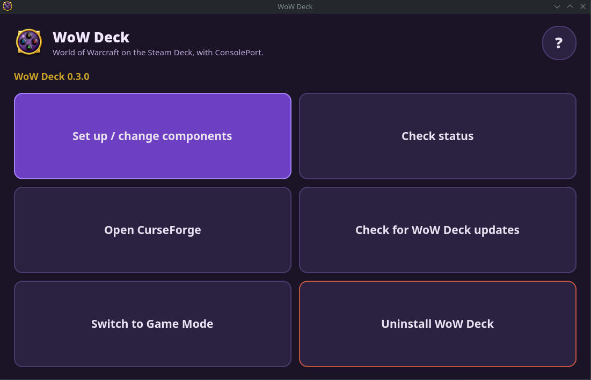

# wow-deck

**One button to set up World of Warcraft on a Steam Deck**, with a controller that fully
works: Battle.net installed and launchable from Game Mode, ConsolePort and friends in place,
an addon manager that knows your game, and the back grips arriving in WoW as native paddle
buttons. Everything is opt-in and everything can be removed again.



The **WoW Deck** app (above) is the whole product: set up or change components, check every
layer, open CurseForge, update WoW Deck itself, switch to Game Mode, or uninstall. The **?**
in the corner explains what each piece does.

Technical documentation: [controller stack](docs/controller-stack.md) (why the grips are lost
and how they come back), [SteamOS integration](docs/steamos-integration.md),
[architecture](docs/architecture.md), [addons and CurseForge](docs/addons-and-curseforge.md).

## Native back-grip (paddle) buttons

On a stock SteamOS Deck, Steam forwards games a virtual Xbox 360 pad, so the L4/L5/R4/R5
grips can never reach WoW as gamepad buttons. wow-deck configures InputPlumber (already part
of SteamOS 3.7+) to present the Deck controller to Proton as a DualSense Edge while WoW runs.
WoW's own SDL maps the Edge natively, so the grips arrive as `PADPADDLE1-4`, and a small
WoW config file puts them in Deck order (L4 = 1, R4 = 2, L5 = 3, R5 = 4).

Steam keeps its own virtual Deck controller at the same time, so the Steam button, the
Quick Access menu, Steam + X and your trackpad layout stay as stock while WoW runs.

## Guide chapter: native paddles (SteamOS 3.7 or newer)

This replaces the old "grip buttons are not recognized, map them to F1-F4" workaround, and
the manual Battle.net / non-Steam-game steps of the community guide: WoW Deck does those too.

1. **Install WoW Deck.** In Desktop Mode open Konsole and run:

   ```
   curl -fsSL https://github.com/seblindfors/wow-deck/releases/latest/download/install.sh | bash
   ```

   This places the app and a **WoW Deck** icon on the Desktop and opens it.
2. **Tick what you want** (Battle.net + WoW is always on; native paddles, ConsolePort,
   BugGrabber + BugSack, CurseForge are optional) and press Continue. The native paddles item
   needs one privileged step; if your Deck has no user password yet, WoW Deck asks you to
   create one right there (no terminal).
3. **Battle.net installs** (accept the defaults), lands in your Steam library with artwork, and
   WoW Deck switches you to Game Mode. There, Battle.net opens: log in with **Steam + X** and
   install World of Warcraft. Everything else finishes in the background while it downloads.
4. **Play.** Launch Battle.net from Game Mode as usual. In ConsolePort pick the **Steam Deck**
   preset; the grips arrive as `PADPADDLE1-4` (L4 = 1, R4 = 2, L5 = 3, R5 = 4).
5. **Later:** the WoW Deck icon is also where you open CurseForge, check status, or update
   WoW Deck itself.

How it works: while WoW runs, the Deck's controller is presented to Proton as a DualSense Edge
(via InputPlumber, which SteamOS ships). WoW knows that controller natively, paddles included.
When you quit Battle.net the controller goes back to normal. Everything survives reboots and
SteamOS updates; `wow-deck uninstall` returns the Deck to stock.

Troubleshooting: `wow-deck doctor`. If the Steam UI ever loses controller input, open a
terminal (or SSH) and run `wow-deck paddles off`.
